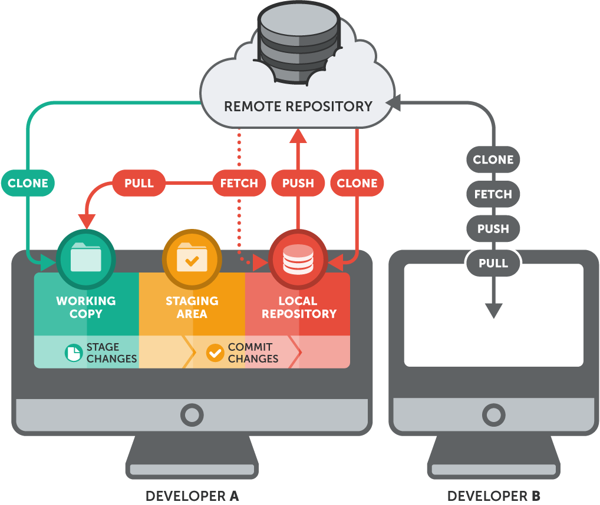

# Session 10 - Machine Learning

### Ciência de Dados Aplicada 2023/2024

## Introduction to Version Control with Git

___

# Why Version Control?

- **Collaboration:** Allows multiple people to work on the same project simultaneously.

- **History tracking:** Records changes made to code over time, enabling easy rollback if needed.

- **Branching:** Facilitates experimentation and parallel development without affecting the main codebase.

- **Backup:** Serves as a backup system, ensuring code is not lost even if local copies are damaged or lost.

- **Code review:** Supports code review processes by providing a clear view of changes made.

- **Continuous integration:** Integrates with CI/CD pipelines, automating testing and deployment processes.

___

# What is Git ?

- **Git is not the same as GitHub!** 

- Git is a **distributed version control system** for the detection of file changes.

- In particular, Git is mostly used for the **management of source code in software development**.

- The primary user interface is the **Unix command line**... however, many IDEs offer an intuitive **GUI for Git** (e.g. VSCode, PyCharm).

- **Github** as well as Sourceforge, Gitlab and so on are **host systems of Git repositories**.

___

# Should you learn Git? - Absolutely!

- **Industry standard:** Git is widely adopted across the software industry.

- **Collaboration:** Understanding Git enables effective collaboration with team members through version control.

- **Project management:** Git facilitates project management by tracking changes, enabling rollbacks, and managing branches.

- **Open-source contribution:** Many open-source projects use Git, and learning Git enables contributions to these projects.

- **Personal projects:** Git can also be beneficial for managing personal projects, tracking changes, and experimenting with different features or ideas.


---

# Git/GitHub Concepts


Image from https://git-scm.com

- Working directory: a directory in your computer where you have your work scripts.
- Staging area: an intermediate "area" where Git can track and save the files alterations. The staging area is an intermediate stage between the working directory and the local repository.
- Local repository: repository where all the files checkpoints, changes and commits are locates. It is a copy of your working directory at some point in time.


Image from https://www.git-tower.com/learn/git/ebook/en/command-line/remote-repositories/introduction

- Remote repository: a repository located in a server, usually in the cloud. It essentially consists in a copy of your local repository and local repositories of your colleagues at some point in time.

Other concepts will be introduced during the practical session.

___

# Practical Session

## Pre requisites:

- **Git**
  - **Install Git:** https://git-scm.com/downloads

- **GitHub Account**

## Setting up

To start using Git, you need to configure your identity:

```bash
git config --global user.name "Your Name"
git config --global user.email "Your Email"
```

NOTE: This will set your identity for all repositories on your machine. If you want to set it for a specific repository, remove the `--global` flag.

Run the following command to check your configuration:

```bash
git config --list
```

___

# Initializing a new local repository

To start a new project, you can create a new directory and initialize a Git repository in it:

```bash
mkdir intro-to-git-repo
cd intro-to-git-repo
git init
```

This will create a new directory called `intro-to-git-repo` and initialize a new Git repository in it.

Try running `ls -a` to see the hidden `.git` directory that was created.

___


# Adding a local repository to GitHub using Git

1. Create a new repository on GitHub.
   - To avoids errors, make sure that you name your repository the same name as your local repository. Also, do not initialize the repository with a README, .gitignore, or license.

2. At the top of your repository on GitHub.com's Quick Setup page, copy the remote repository URL.

3. To add the URL for the remote repository where your local repository will be pushed, run the following command. Replace REMOTE-URL with the repository's full URL on GitHub.

```bash
git remote add origin REMOTE-URL
```

4. Verify that the remote URL has been added:

```bash
git remote -v
```

___

# Creating a new repository on GitHub first

If you plan to use GitHub to host your repository, you can create a new repository on GitHub first and then clone it to your local machine.

1. Create a new repository on GitHub (in this case you can add a README, .gitignore, or license if you want).
2. Clone the repository to your local machine:

```bash
git clone REPOSITORY-URL
```

___

# Monitoring changes

Your first best friend in Git is the `status` command. It shows you the status of your working directory.

```bash
git status
```

Because you just initialized the repository, you should see a message saying that there are no commits yet.

___

# Committing changes

Commits are the way to save changes to your local repository. They are like snapshots of your project at a given time.

Commits are "cheap" in Git, so you should commit often. This way, you can easily roll back to a previous state if needed.

Committing in Git works in two steps. First modified or untracked files are "registered" for the next commit
by using `add` . This is called staging. The staged files are then committed with `commit`.

# Staging changes

Let's create a new file and stage it for commit:

```bash
echo "Hello, world!" > hello.txt
```

Now, let's check the status:

```bash
git status
```

You should see that `hello.txt` is an untracked file.

To stage the file for commit, run:

```bash
git add hello.txt
```

Now, check the status again:

```bash
git status
```

You should see that `hello.txt` is now staged for commit.

___

# Committing changes

Now that `hello.txt` is staged for commit, let's commit it:

```bash
git commit -m "Add hello.txt"
```

The `-m` flag is used to add a commit message. This message should be a short description of the changes made in the commit.

Now, check the status again:

```bash
git status
```

You should see that there is nothing to commit.

___

# Monitoring changes

You can use the `log` command to see the history of commits in your repository:

```bash
git log
```

This will show you a list of commits, including the commit hash, author, date, and commit message.

### Let's change the content of `hello.txt` and use `git status` and `git diff` to see the changes.

```bash
echo "Hello, world! This is a new line." > hello.txt
```

```bash
git status
```

```bash
git diff hello.txt
```

You can use `git diff` whitout a file name to see all the changes in the repository.

Let's stage and commit the changes.

```bash
git add hello.txt
git commit -m "Add a new line to hello.txt"
```

___

# Pushing changes to the remote repository

To push your changes to the remote repository, use the `push` command:

```bash
git push origin master
```

This will push the changes in your local repository to the remote repository. The `origin` is the name of the remote repository, and `master` is the name of the branch you are pushing to.
Note: These are the default names for the remote and main branch, but they can be different (e.g. `main` instead of `master`).

You main need to authenticate with your GitHub credentials. To generate a personal access token, follow the instructions at [Create Personal Access Token](https://docs.github.com/en/authentication/keeping-your-account-and-data-secure/managing-your-personal-access-tokens#creating-a-personal-access-token-classic).

___

# Pulling changes from the remote repository

To pull changes from the remote repository, use the `pull` command:

```bash
git pull origin master
```

This will pull the changes from the remote repository to your local repository. The `origin` is the name of the remote repository, and `main` is the name of the branch you are pulling from.

Because no changes were made to the remote repository, you should see a message saying that your branch is up to date.

___

# Branching

Branching is a core concept in Git. It allows you to diverge from the main line of development and continue working without affecting the main codebase.

Branches are lightweight and easy to create, so you can use them to experiment with new features, fix bugs, or work on different parts of the project.


Image from https://www.nobledesktop.com/learn/git/git-branches

To check the branches in your repository, use the `branch` command:

```bash
git branch
```

This will show you a list of branches in your repository. The branch with an asterisk (`*`) next to it is the current branch.

We can create a new branch using the `branch` command:

```bash
git branch new-feature
```

Now, if you run `git branch` again, you should see the new branch in the list.

To switch to the new branch, use the `checkout` command:

```bash
git checkout new-feature
```

Now, if you run `git branch` again, you should see the asterisk next to the new branch.

Push the new branch to the remote repository:

```bash
git push origin new-feature
```

___

# Merging branches

Once you have finished working on a branch, you can merge it back into the main branch.

Let's make some changes to `hello.txt` in the new branch:

```bash
echo "Hello, world! This is a new line in the new-feature branch." > hello.txt
```

Now, stage and commit the changes:

```bash
git add hello.txt
git commit -m "Add a new line to hello.txt in the new-feature branch"
```

Now, let's merge the new branch into the main branch.

First, switch back to the main branch:

```bash
git checkout master
```

Now, merge the new branch into the main branch:

```bash
git merge new-feature
```

If there are no conflicts, the merge will be successful.

Now, push the changes to the remote repository:

```bash
git push origin master
```

**This can be done on the GitHub website as well in the form of a pull request. It is a way to propose changes to the main branch and discuss them with others.**

Remember to delete the branch after merging it:

```bash
git branch -d new-feature
```

Delete the branch in the remote repository:

```bash
git push origin --delete new-feature
```

___

# Conclusion

Let's discuss a little bit more about the following image:


- What terms do you recognize?
- What terms do you not recognize?